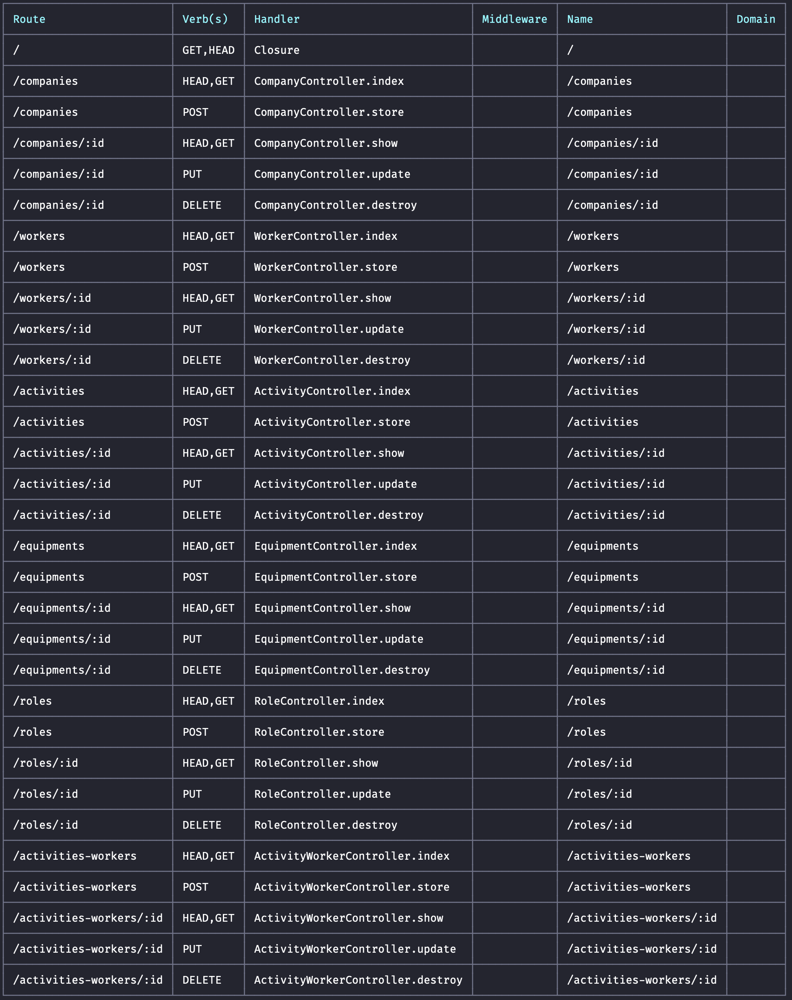

# SEA Tecnologia

### Projeto técnico do Processo Seletivo da SEA Tecnologia

Este projeto é composto por um front-end e um back-end. O front-end foi desenvolvido em react, e o back-end foi
desenvolvido em AdonisJS, construção de uma API.

## Pré-requisitos

- Node.js (versão 14 ou superior)
- NPM ou Yarn
- SQLite (para o banco de dados)

## Configuração do Backend (API)

### Instalação de Dependências

1. Navegue até o diretório do backend:
   ```sh
   cd backend
   npm install
   cp .env.example .env
   ```

2. Para criar as tabelas no banco de dados, execute as migrações:

   ```sh 
   adonis migration:run
   ```
3. Para popular o banco de dados com dados iniciais, execute os seeds:
    ```sh 
    adonis seed 
    ```
4. Para iniciar o servidor:
   ```sh 
   adonis serve --dev
   ```

### O servidor estará rodando em http://localhost:3333

## Rotas api



## Configuração do Frontend

1. Navegue até o diretório do frontend:

   ```sh 
   cd frontend
   npm install ou yarn install
   yarn start
   ```

