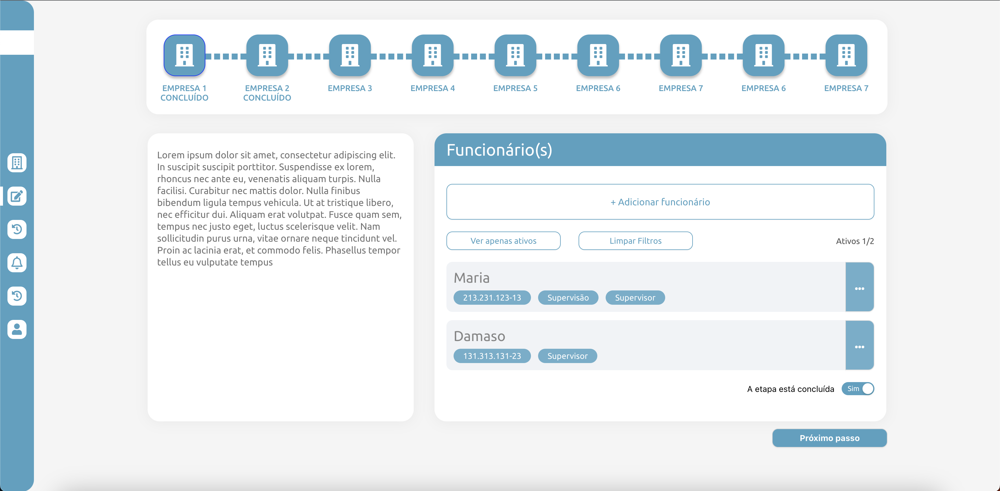
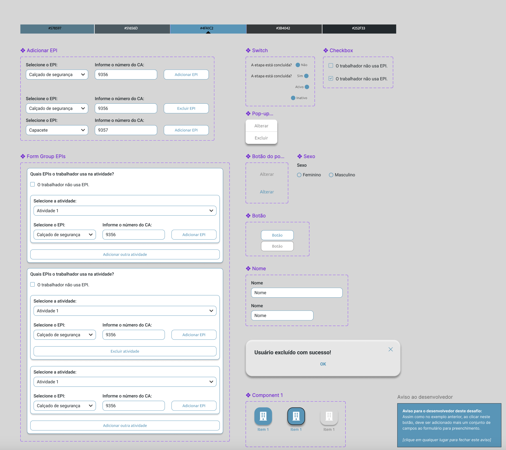

## Descrição

Protótipo
do [Figma](https://www.figma.com/file/gGePjuPTHdH7pISofjrzxB/Desafio-React?type=design&node-id=8-8&t=FX1K5qxoaUjWtxu8-0),
que é a página de CRUD de Funcionários.



## Tecnologias utilizadas

Tecnologias utilizadas:

- TypeScript: Linguagem oriunda do JavaScript que tem um alto poder de linguagem, utilizado nesse projeto para facilitar
  o desenvolvimento.
- Formik: Biblioteca de controle de formulários, foi utilizado para realizar a organização e validação do formulário de
  criação e edição de funcionários.
- Redux: Biblioteca de controle de estados, foi utilizado para o controle de dados carregados da API pela aplicação,
  além de controlar o estado dos elementos principais ao realizar modificações na API ou na próprio aplicação.
- SASS: Extensão de linguagem do CSS que realiza uma organização mais criteriosa dos arquivos de estilo.
- Yup: Biblioteca de validação que é utilizado em conjunto com o Formik.
- Ant Design: Biblioteca de estilos do React, foi utilizado principalmente para certa organização de alguns componentes,
  como modal, botões dropdown, etc.

## Funcionalidades

É possível nesse projeto:

- Criar funcionários.
- Deletar funcionários.
- Editar funcionários.
- Filtrar funcionários ativos.
- Acessar listagem de funcionários e descrição de várias empresas.
- Editar propriedade da empresa, se a "Etapa está concluida" ou não.

## Configuração do Frontend

1. Navegue até o diretório do frontend:

   ```sh 
   cd frontend
   npm install ou yarn install
   yarn start
   ```

### Obervação: API tem que está rodando para funcionar


